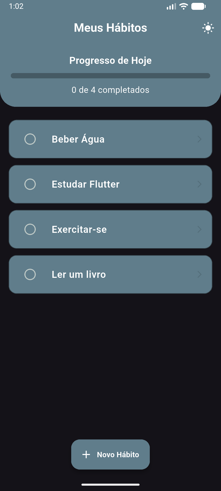
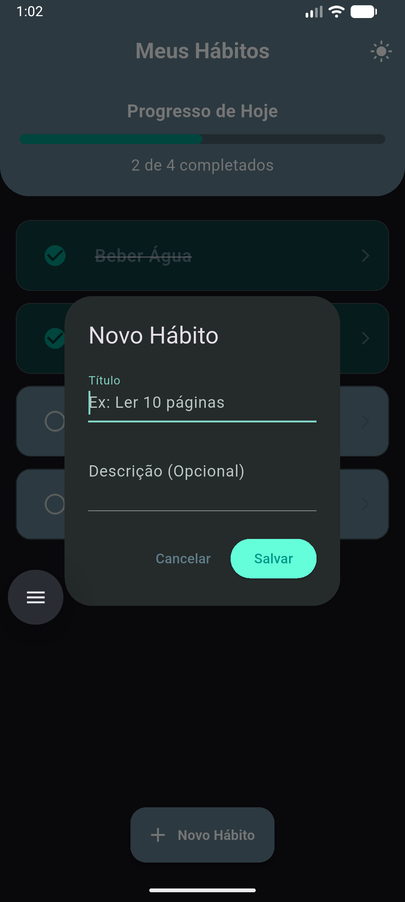
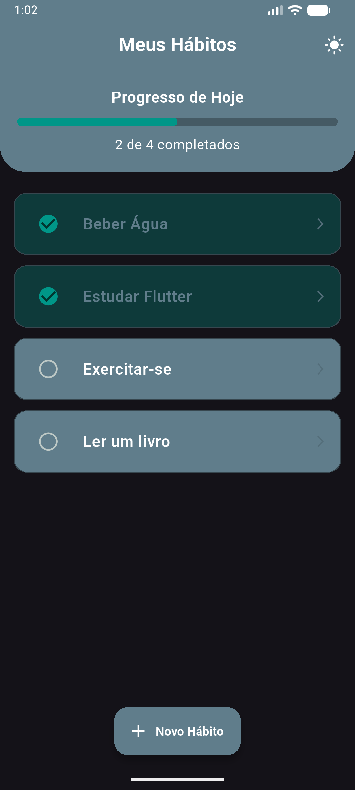
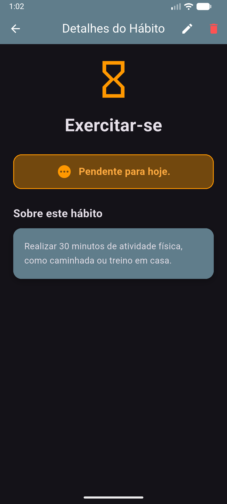
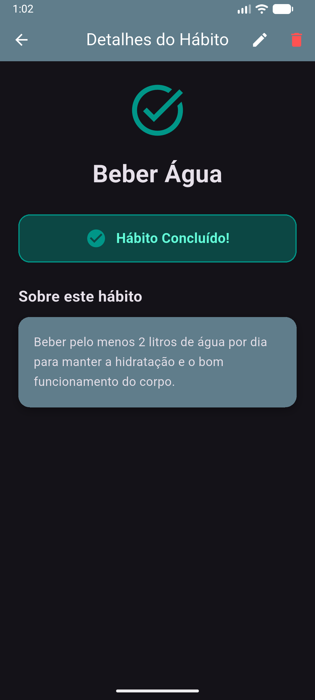
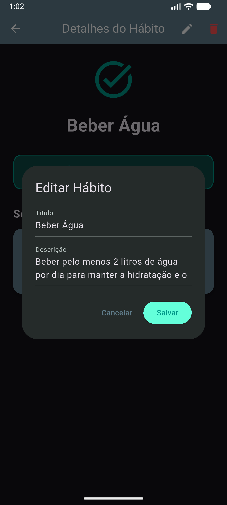
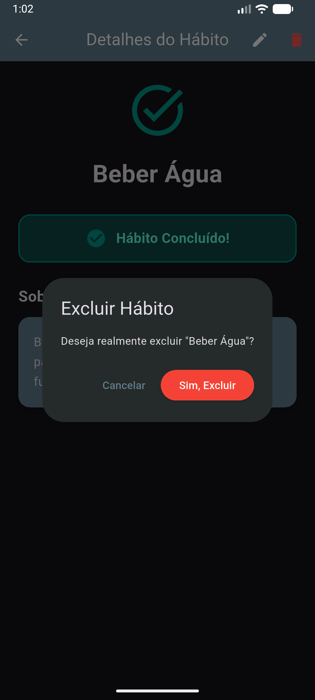

# Miniprojeto: Controle de Hábitos ✅

**Faculdade Senac Joinville**  
**Curso:** Análise e Desenvolvimento de Sistemas - 5ª Fase (2026/1)  
**Disciplina:** Desenvolvimento para Dispositivos Móveis  
**Professor:** Gabriel Caixeta Silva  
**Aluno:** Lincoln Novais Mezzalira

## 📱 Descrição do Aplicativo
Aplicativo desenvolvido como Atividade Prática Avaliativa de Revisão. O objetivo do app é permitir ao usuário acompanhar e gerenciar seus hábitos diários, marcando-os como realizados. O projeto consolida conceitos fundamentais do Flutter, como gerenciamento de estado (`setState`), navegação entre telas (`Navigator.push`), programação assíncrona (`Future.delayed`) e manipulação de listas.

## ⚙️ Funcionalidades Implementadas
***Carregamento Assíncrono:** Simulação de carregamento inicial (splash) utilizando `async/await`.
***Gerenciamento de Hábitos (CRUD):** * Criação de novos hábitos personalizados.
  * Leitura e listagem na tela principal.
  * Edição de título e descrição de hábitos existentes.
  * Exclusão de hábitos com modal de confirmação.
***Interatividade de Conclusão:** Checkboxes redondos para marcar hábitos como concluídos, alterando visualmente o estado do item (texto riscado e mudança de cor).
***Barra de Progresso:** Feedback visual e intuitivo mostrando a porcentagem de hábitos concluídos no dia.
***Navegação com Passagem de Dados:** Envio do objeto do hábito selecionado da lista para a tela de detalhes.
***Modo Escuro (Dark Mode):** Alternância de tema global dinâmico utilizando *State Lifting*.
***Alertas Modernos:** Utilização de *SnackBars* flutuantes para feedback de ações (criar, editar, excluir).

## 🖼️ Screenshots do Aplicativo
> *Nota: Telas demonstrando a interface interativa e o gerenciamento de estado em funcionamento.*

### 📌 Fluxo Principal
| Tela Inicial | Novo Hábito | Progresso Diário |
| :---: | :---: | :---: |
|  |  |  |

### 🛠️ Detalhes e Gerenciamento
| Hábito Pendente | Hábito Concluído | Editar | Excluir |
| :---: | :---: | :---: | :---: |
|  |  |  |  |

## 🚀 Instruções para Execução do Projeto
Siga os passos abaixo para testar o aplicativo em sua máquina local:
 
## 🚀 Instruções para Execução
 
1. **Clone o repositório:**
```bash
git clone git@github.com:function404/controle-habitos-flutter-lincoln.git
```
 
2. **Entre na pasta do projeto:**
```bash
cd seu-repositorio
```
 
3. **Instale as dependências:**
```bash
flutter pub get
```
 
4. **Execute o aplicativo:**
```bash
flutter run
```
